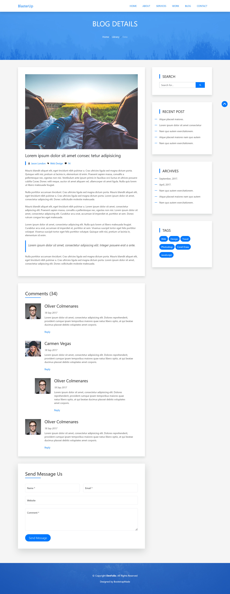

# route_assignment_6 (Responsive Design)

This is my work assigned by [Route-Academy](https://www.linkedin.com/company/routeacademy/mycompany/) during learning front-end web development.

## Table of contents

- [Screenshot](#screenshot)
- [Links](#links)
- [Built with](#built-with)
- [Author](#author)

### Screenshot

### Links

- Solution URL: [Code](https://github.com/IMostafaR/-route_assignment_6)
- Live Site URL: [Live Site](https://imostafar.github.io/-route_assignment_6/)

### Built with

- HTML5
- CSS
- Bootstrap 5

## Author

- GitHub - [Mostafa Ragab](https://github.com/IMostafaR)
- Frontend Mentor - [@IMostafaR](https://www.frontendmentor.io/profile/IMostafaR)
- Linkedin - [@imostafarh](https://www.linkedin.com/in/imostafarh/)
